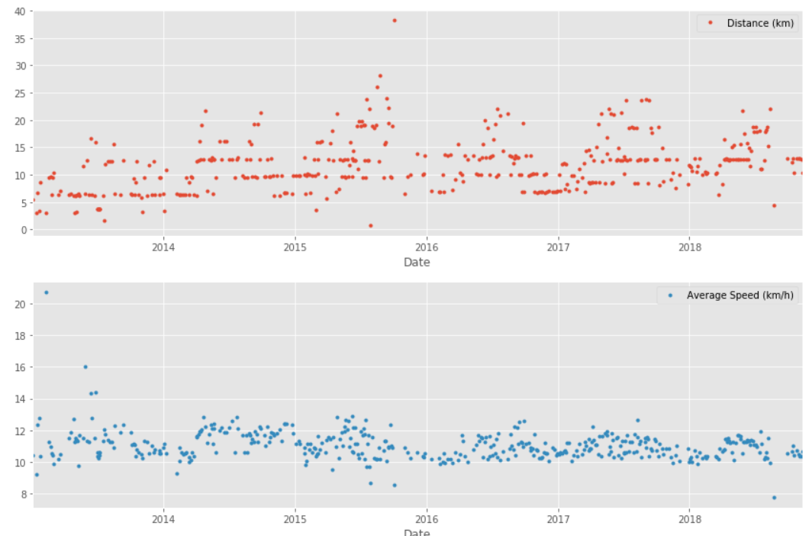
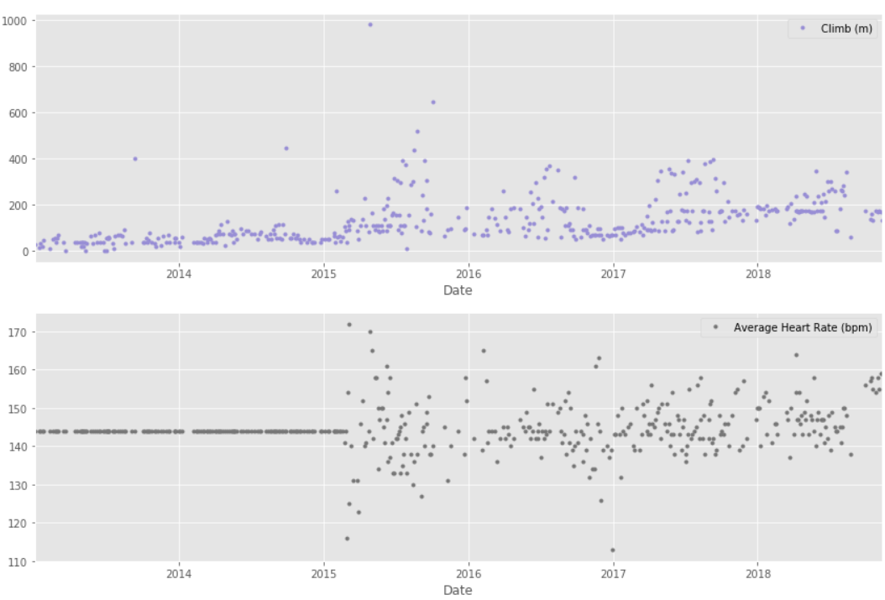
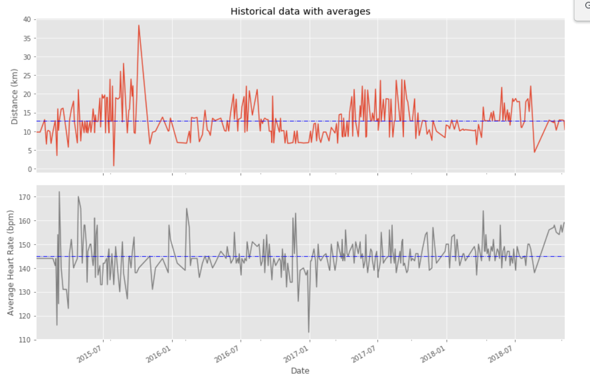
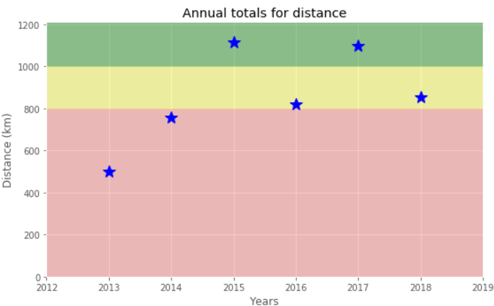
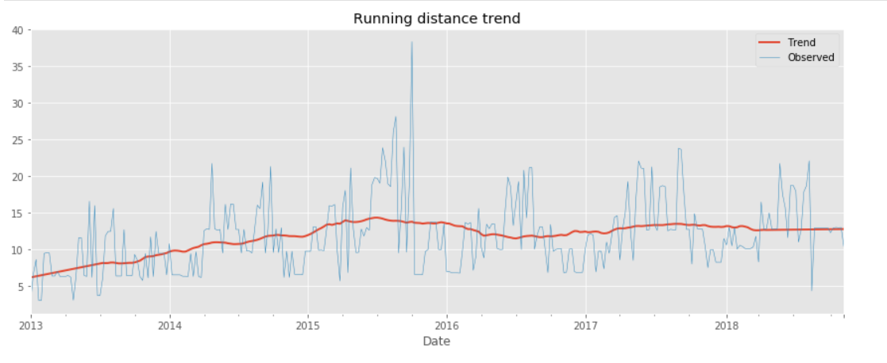
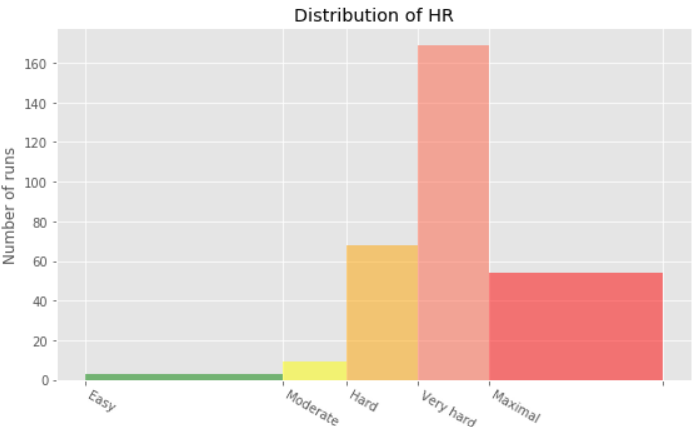
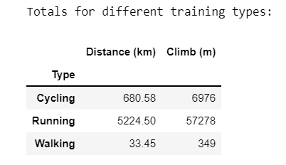
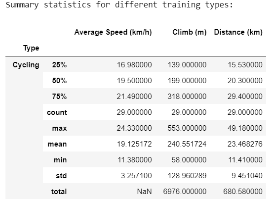
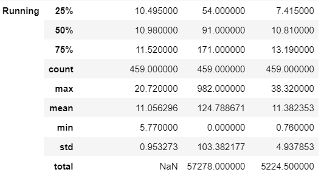
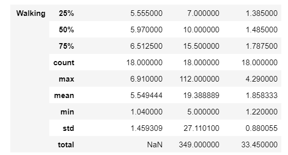

# Analyze-Your-Runkeeper-Fitness-Data🏃‍♀️

##	📃 Introduction :
Avec l'explosion de la popularité des trackers de fitness, les coureurs du monde entier collectent des données avec des gadgets (smartphones, montres, etc.) pour rester motivés. Ils cherchent des réponses à des questions telles que :

      ▪️ Quelle a été la vitesse, la durée et l'intensité de ma course aujourd'hui ?
      ▪️ Ai-je atteint mes objectifs d'entraînement ?
      ▪️ Est-ce que je progresse ?
      ▪️ Quelles ont été mes meilleures réalisations ?
      ▪️ Comment est-ce que je performe par rapport aux autres ?
Ce projet analyse les données d'un coureur sur sept ans collectées à partir du dispositif de suivi Runkeeper. Les données sont un fichier CSV où chaque ligne est une seule activité de formation.
Dans ce projet, nous allons créer, importer, nettoyer et analyser les données pour répondre aux questions.

🚶🏃🚴
## 💻 Les Tâches du projet
###### 📎. Obtenir et examiner les données brutes
###### 📎📎. Prétraitement des données
###### 📎📎📎. Traiter des valeurs manquantes
###### 📎📎📎📎. Tracer les données en cours d'exécution
###### 📎📎📎📎📎.Statistiques de course
###### 📎📎📎📎📎📎.Préparez les données et créez un graphique.
###### 📎📎📎📎📎📎📎.Créez un tracé avec la distance observée des pistes et la tendance décomposée.
###### 📎📎📎📎📎📎📎📎.Créer un histogramme personnalisé pour la distribution de la fréquence cardiaque
###### 📎📎📎📎📎📎📎📎📎.Créer un rapport de synthèse

#### 📋 Chargez les données des activités d'entraînement :
######  runkeeper_file = 'datasets/cardioActivities.csv'

#### 📈 visualisation des données de course:

#### 📊 Visualisation avec moyennes :
Traçons les moyennes à long terme de la distance parcourue et de la fréquence cardiaque avec leurs données brutes pour comparer visuellement les moyennes de chaque séance d'entraînement en utilison les données de 2015 à 2018.

#### 📈 visualisation de la distance de course annuelle (km) de 2013 à 2018:
Pour se motiver à courir régulièrement,cet utilisateur s'est fixé comme objectif de courir 1000 km par an:

####  Est-ce que il progresse ? :
Pour répondre à cette question, nous allons décomposer la course de distance hebdomadaire et la comparer visuellement aux données brutes. Une ligne de tendance rouge représentera la distance hebdomadaire parcourue

#### 📊 Intensité d'entraînement
création d'un diagramme de distribution des données de fréquence cardiaque par intensité d'entraînement.
Il s'agit d'une présentation visuelle du nombre d'activités à partir de zones d'entraînement prédéfinies.

#### Rapport de synthèse détaillé
Pour ce faire, nous allons créer deux tables. Le premier tableau sera un résumé des variables de distance (km) et de dénivelé (m) pour chaque activité d'entraînement. Le deuxième tableau répertorie les statistiques récapitulatives pour les variables de vitesse moyenne (km/h), de montée (m) et de distance (km) pour chaque activité d'entraînement

🚴
🏃
🚶